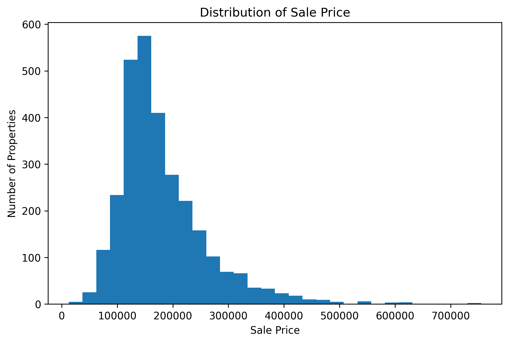
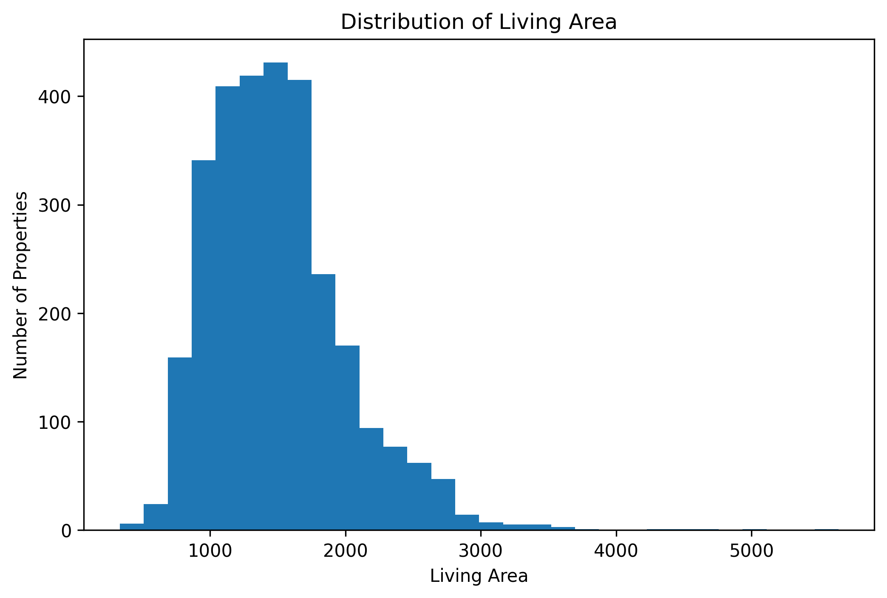
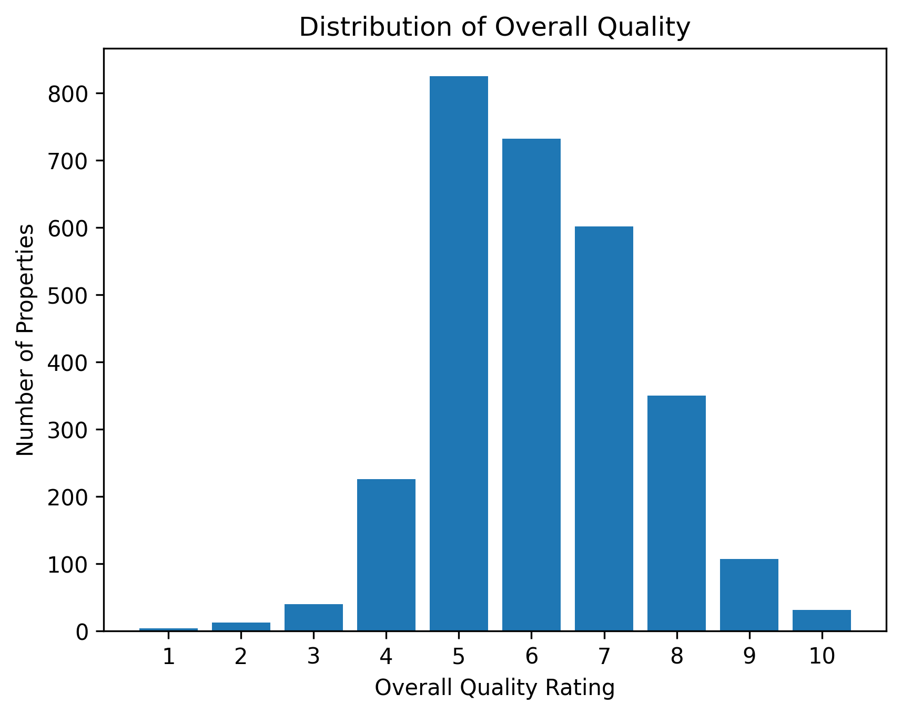
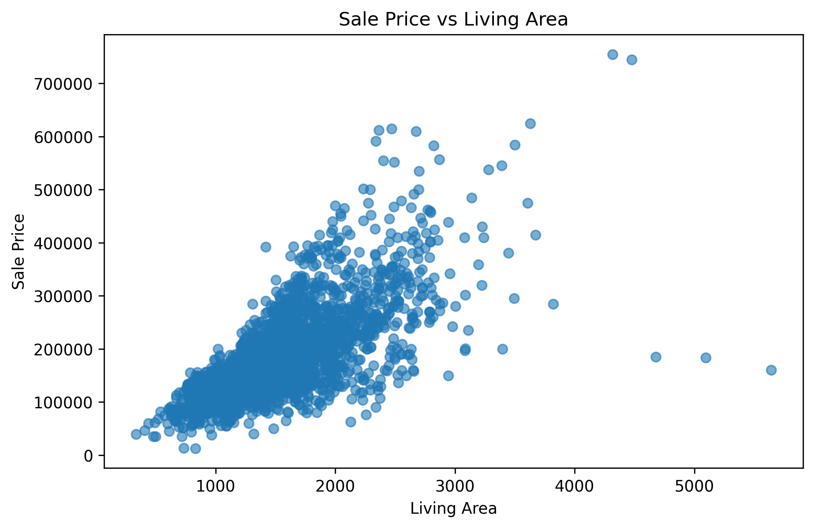
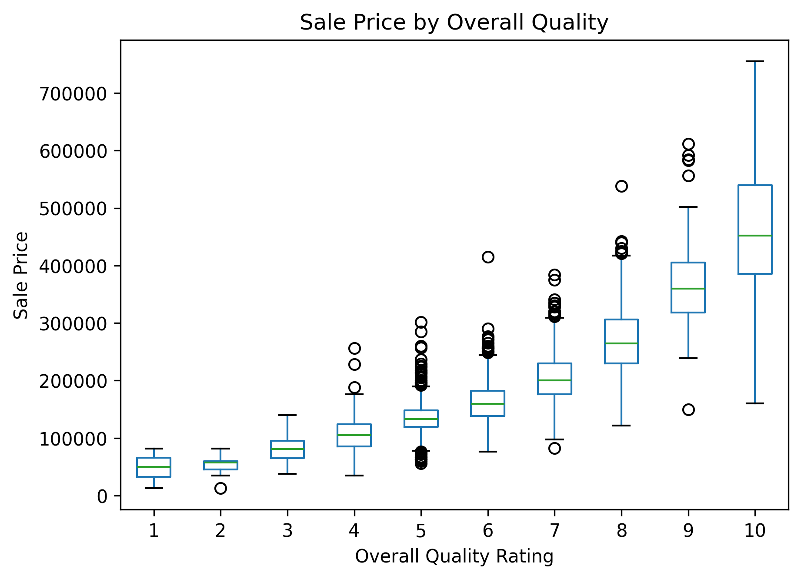
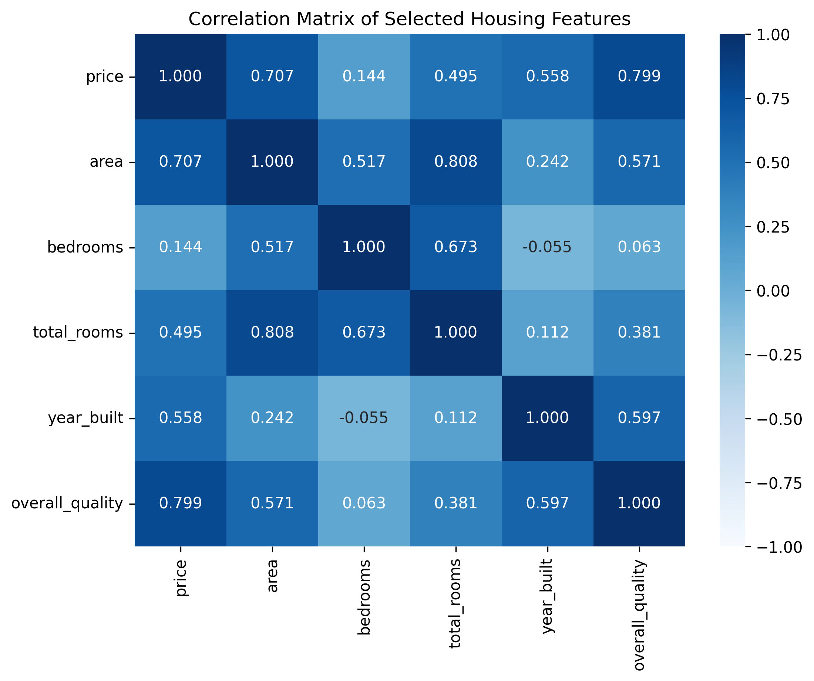
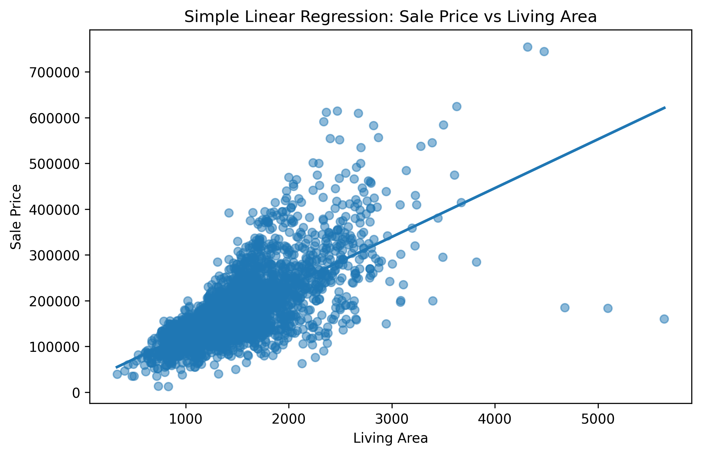
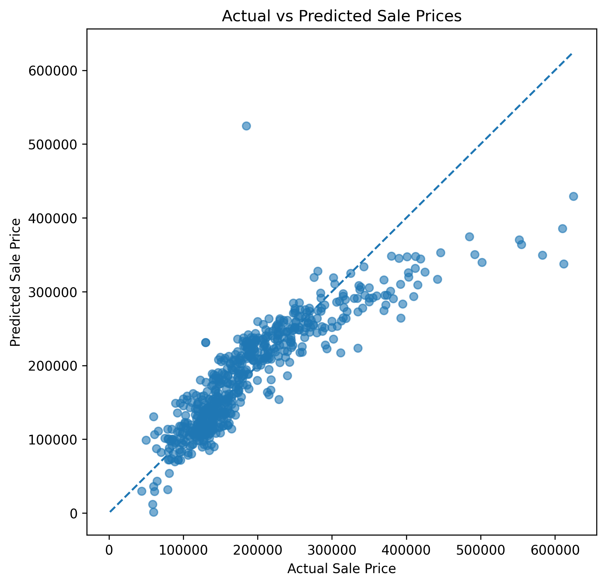
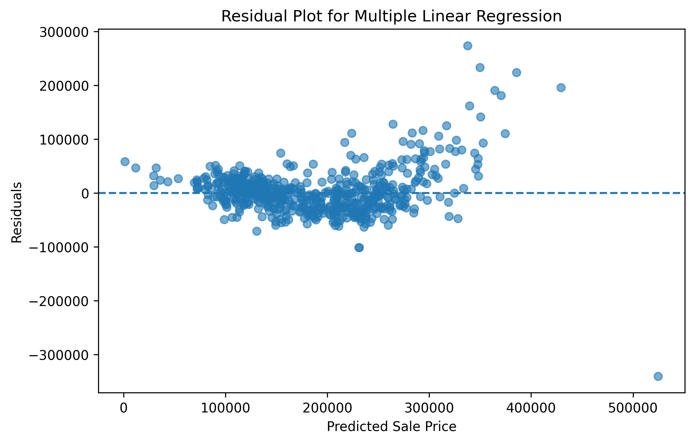

# Ames Housing Price Regression Analysis

## Project Overview

This project analyzes housing prices using the Ames Housing dataset.

The goal of the analysis was to understand which property characteristics are most strongly related to sale price and to check how well selected numerical features can predict house prices.

I started with exploratory data analysis to understand how prices, living area, and quality ratings are distributed. Then I analyzed relationships between variables, checked correlations, and built two regression models:

- a simple linear regression model using only living area,
- a multiple linear regression model using several property characteristics.

The purpose of this project was not only to build a model, but also to understand what the model tells us, which variables matter most, and where the model still has limitations.

---

## Dataset

The dataset contains **2,930 residential property records** and **82 variables** describing different aspects of each property.

For this project, I focused on selected numerical variables that are easy to interpret and suitable for regression modeling.

| Variable | Description |
|---|---|
| `price` | Final sale price of the property |
| `area` | Above-ground living area |
| `bedrooms` | Number of bedrooms above ground |
| `total_rooms` | Total number of rooms above ground |
| `year_built` | Original construction year |
| `overall_quality` | Overall material and finish quality rating |

The target variable in this analysis is `price`.

The selected explanatory variables describe basic property characteristics such as size, number of rooms, construction year, and quality.

---

## Analytical Questions

The analysis was guided by a few practical questions:

- Which numerical features are most strongly related to house price?
- Is living area enough to explain price differences between properties?
- How important is overall quality compared with size?
- Can a regression model estimate house prices with reasonable accuracy?
- Where does the model perform well, and where does it still make larger errors?

---

## Tools and Libraries

The project was completed in Python using:

- `pandas` for data manipulation,
- `numpy` for numerical operations,
- `matplotlib` and `seaborn` for visualization,
- `scikit-learn` for regression modeling and model evaluation.

---

## Analysis Workflow

The project follows a structured analysis process:

1. Load and inspect the dataset.
2. Select and rename key variables.
3. Check data quality.
4. Explore price, living area, and quality distributions.
5. Analyze relationships between price and property features.
6. Calculate correlations.
7. Build a simple linear regression model.
8. Build a multiple linear regression model.
9. Compare model performance.
10. Analyze prediction errors.
11. Summarize key conclusions.

---

## Data Quality Check

The selected variables did not contain missing values, so no imputation or row removal was needed for this part of the analysis.

The simplified working dataset contained **11 repeated rows** based only on the selected variables. I did not remove them automatically because repeated combinations may still represent different properties in the original dataset.

In housing data, it is possible for multiple homes to have the same sale price, living area, number of rooms, year built, and quality rating. Removing such rows without checking the full original record could lead to deleting valid observations.

---

## Summary Statistics

| Metric | Price | Living Area | Bedrooms | Total Rooms | Year Built | Overall Quality |
|---|---:|---:|---:|---:|---:|---:|
| Count | 2,930 | 2,930 | 2,930 | 2,930 | 2,930 | 2,930 |
| Mean | 180,797 | 1,500 | 2.85 | 6.44 | 1971 | 6.10 |
| Median | 160,000 | 1,442 | 3 | 6 | 1973 | 6 |
| Min | 12,789 | 334 | 0 | 2 | 1872 | 1 |
| Max | 755,000 | 5,642 | 8 | 15 | 2010 | 10 |

The average sale price is higher than the median sale price, which already suggests that the price distribution is right-skewed.

This is common in housing data. Most homes are sold in moderate price ranges, while a smaller number of expensive properties pulls the average upward.

---

# Exploratory Data Analysis

## Sale Price Distribution

<p align="center">
  
</p>

<p align="center">
  <i><b>Figure 1.</b> Sale prices are right-skewed, with most properties concentrated in lower and mid-range price levels.</i>
</p>

The sale price distribution is clearly right-skewed.

Most properties are concentrated in the lower and middle price ranges, mainly between approximately **100,000 and 250,000**. There are fewer expensive properties, but they extend the distribution far to the right, with some homes priced above **500,000**.

This explains why the mean sale price is higher than the median.

This pattern matters for modeling because expensive or unusual properties may be harder to predict accurately using only basic numerical features.

---

## Living Area Distribution

<p align="center">
  
</p>

<p align="center">
  <i><b>Figure 2.</b> Most properties have a typical living area between approximately 1,000 and 2,000 square feet, while a few much larger homes extend the distribution to the right.</i>
</p>

Living area is also right-skewed.

Most properties have a living area between approximately **1,000 and 2,000 square feet**, which is consistent with the median value of **1,442**.

There are also several much larger homes, including properties above **3,000 square feet** and a few observations above **5,000 square feet**.

These larger properties are important because they may strongly influence the regression model, especially if their prices do not follow the same pattern as typical homes.

---

## Overall Quality Distribution

<p align="center">
  
</p>

<p align="center">
  <i><b>Figure 3.</b> Most properties are rated between 5 and 7 in overall quality, meaning the dataset is mainly composed of average to above-average quality homes.</i>
</p>

Most properties are rated between **5 and 7** in overall quality, with rating **5** being the most common.

Very low quality ratings, such as **1–3**, are rare. Very high quality ratings, especially **9–10**, are also much less common.

This means the dataset mostly contains average to above-average quality homes.

This variable is important because quality describes something that living area alone cannot capture: the standard of materials and finish.

---

## Sale Price vs Living Area

<p align="center">
  
</p>

<p align="center">
  <i><b>Figure 4.</b> Larger properties generally sell for higher prices, but homes with similar living area can still have very different sale prices.</i>
</p>

The scatter plot shows a clear positive relationship between living area and sale price.

In general, larger properties tend to sell for higher prices. However, the relationship is not perfect. Houses with similar living area can still have very different sale prices.

This suggests that size is important, but it is not the only factor influencing property value.

There are also a few unusual observations with very large living area but relatively low sale price. These points may affect the simple linear regression model and should be kept in mind when interpreting its results.

---

## Sale Price by Overall Quality

<p align="center">
  
</p>

<p align="center">
  <i><b>Figure 5.</b> Sale price increases clearly with overall quality, especially for properties rated 8, 9, and 10.</i>
</p>

Sale price increases clearly with overall quality.

Properties rated **8, 9, and 10** have much higher median prices than properties with average or low quality ratings.

The difference between quality groups is stronger and more consistent than the pattern visible for living area alone. This suggests that overall quality is one of the most important variables for explaining sale price in this dataset.

There are still outliers within several quality groups, which means that quality matters, but it does not explain the full price variation by itself.

---

# Correlation Analysis

<p align="center">
  
</p>

<p align="center">
  <i><b>Figure 6.</b> Overall quality and living area have the strongest correlations with sale price among the selected numerical features.</i>
</p>

Correlation analysis confirmed the patterns visible in the charts.

The strongest correlation with sale price was observed for `overall_quality`:

```text
r = 0.799
```

Living area also had a strong positive relationship with sale price:

```text
r = 0.707
```

Other selected variables showed weaker or moderate relationships with price.

| Feature | Correlation with Price |
|---|---:|
| `overall_quality` | 0.799 |
| `area` | 0.707 |
| `year_built` | 0.558 |
| `total_rooms` | 0.495 |
| `bedrooms` | 0.144 |

The results suggest that `overall_quality` and `area` are the strongest individual predictors of sale price among the selected variables.

It is also important to notice that some predictors are correlated with each other. For example, living area and total rooms have a strong correlation:

```text
r = 0.808
```

This makes sense because larger houses usually have more rooms. However, it also means that these variables may partly carry overlapping information in a regression model.

---

# Simple Linear Regression

The first model used only living area to predict sale price:

```text
price ~ area
```

Living area was chosen because it had a strong positive correlation with sale price and is easy to interpret.

---

## Simple Regression Result

| Value | Result |
|---|---:|
| Coefficient | 106.73 |
| Intercept | 19,250.56 |

The coefficient means that the model estimates an increase of about **106.73** in sale price for each additional square foot of living area.

The intercept should not be interpreted literally because a property with zero living area is not realistic. In this model, the intercept mainly helps position the regression line.

<p align="center">
  
</p>

<p align="center">
  <i><b>Figure 7.</b> The simple linear regression model confirms a positive relationship between living area and sale price, but the spread of points shows that area alone does not fully explain property value.</i>
</p>

The regression line confirms the positive relationship between living area and sale price.

As living area increases, predicted sale price also increases. However, the points are not evenly concentrated around the line, especially for larger properties.

This shows that living area is useful, but it cannot fully explain house prices by itself.

---

## Simple Model Performance

| Metric | Value |
|---|---:|
| R² | 0.523 |
| MAE | 41,365.51 |
| RMSE | 61,815.73 |

The simple linear regression model explained about **52.3%** of the variation in sale price.

This is a reasonable result for a model using only one predictor. However, the average prediction error was still high. On average, the model's predictions differed from actual sale prices by about **41,366**.

This suggested that additional property features were needed.

---

# Multiple Linear Regression

The second model used several property features:

```text
price ~ area + bedrooms + total_rooms + year_built + overall_quality
```

This model allows sale price to be estimated using not only size, but also quality, construction year, and room-related characteristics.

---

## Model Coefficients

| Feature | Coefficient |
|---|---:|
| `overall_quality` | 23,305.24 |
| `year_built` | 491.34 |
| `area` | 75.88 |
| `total_rooms` | -741.81 |
| `bedrooms` | -10,792.26 |

`overall_quality` had the largest positive coefficient.

According to the model, increasing the quality rating by one point was associated with an increase of about **23,305** in predicted sale price, assuming the other variables stayed the same.

Living area also remained positive. After accounting for quality, year built, rooms, and bedrooms, each additional square foot was associated with an increase of about **75.88** in predicted sale price.

The negative coefficients for `bedrooms` and `total_rooms` should be interpreted carefully. They do not mean that rooms directly reduce property value.

These variables are related to living area and to each other, so their coefficients can change when they are included in the same model. This is why regression coefficients should be interpreted in context, not as simple standalone relationships.

---

## Multiple Model Performance

| Metric | Value |
|---|---:|
| R² | 0.767 |
| MAE | 28,322.21 |
| RMSE | 43,213.59 |

The multiple linear regression model explained about **76.7%** of the variation in sale price.

The average prediction error decreased to approximately **28,322**, which means the model performed noticeably better after adding more property features.

This confirms that housing prices are influenced by more than living area alone.

---

# Model Comparison

| Model | R² | MAE | RMSE |
|---|---:|---:|---:|
| Simple Linear Regression | 0.523 | 41,365.51 | 61,815.73 |
| Multiple Linear Regression | 0.767 | 28,322.21 | 43,213.59 |

Adding more property features improved the model substantially.

The simple model explained **52.3%** of sale price variation, while the multiple regression model explained **76.7%**.

Prediction error also decreased:

- MAE decreased from about **41,366** to **28,322**.
- RMSE decreased from about **61,816** to **43,214**.

This shows that property price is not driven by living area alone. Overall quality, year built, and other property characteristics add important information.

---

# Model Diagnostics

## Actual vs Predicted Sale Prices

<p align="center">
  
</p>

<p align="center">
  <i><b>Figure 8.</b> The multiple regression model performs reasonably well for lower and mid-range properties, but it tends to underestimate more expensive homes.</i>
</p>

The actual vs predicted plot shows that the multiple regression model performs reasonably well for lower and mid-range properties.

Most points are located close to the diagonal line, meaning that predicted prices are often fairly close to actual sale prices.

However, the model is less accurate for more expensive properties. For higher actual sale prices, many points fall below the diagonal line. This means that the model tends to underestimate expensive homes.

This suggests that the selected numerical features explain a large part of price variation, but they are still not enough to fully capture what makes some properties significantly more expensive.

---

## Residual Analysis

<p align="center">
  
</p>

<p align="center">
  <i><b>Figure 9.</b> Residuals are mostly centered around zero for typical properties, but errors become larger for more expensive or less typical homes.</i>
</p>

The residual plot shows that prediction errors are not perfectly random.

For lower and mid-range predicted prices, residuals are mostly concentrated around zero. This suggests that the model works reasonably well for typical properties.

For higher predicted prices, the spread of residuals becomes larger. This means that the model makes bigger errors for more expensive or less typical homes.

There is also at least one strong negative residual, where the model overestimated the sale price by a large amount.

Overall, the residual plot confirms that the multiple regression model is useful, but still simplified. Housing prices are influenced by additional factors that are not included in this version of the model.

---

# Main Conclusions

This project showed that housing prices are influenced by multiple property characteristics, not only living area.

The exploratory analysis showed that both sale price and living area are right-skewed. Most homes are concentrated in moderate price and size ranges, while a smaller number of expensive or very large properties extend the upper tail of the distributions.

Correlation analysis showed that `overall_quality` and `area` had the strongest relationships with sale price among the selected variables. Overall quality had the strongest correlation with price, suggesting that the standard of materials and finish is especially important.

The simple linear regression model using only living area explained about **52.3%** of sale price variation.

After adding overall quality, year built, total rooms, and bedrooms, the multiple regression model explained about **76.7%** of sale price variation.

The model comparison confirmed that adding more property features improved prediction quality. However, residual analysis showed that the model still made larger errors for some expensive or unusual properties.

A more complete housing price model would likely benefit from additional variables such as:

- neighborhood,
- property condition,
- garage quality,
- basement features,
- lot characteristics,
- other categorical property attributes.

---

## Skills Demonstrated

This project demonstrates practical data analysis skills, including:

- data loading and inspection,
- data quality checking,
- feature selection,
- exploratory data analysis,
- data visualization,
- correlation analysis,
- simple linear regression,
- multiple linear regression,
- model evaluation,
- residual analysis,
- interpretation of results,
- communicating analytical findings clearly.

---

## Repository Structure

```text
ames-housing-price-regression-analysis/
│
├── data/
│   └── ames.csv
│
├── obrazy/
│   ├── price_distribution.png
│   ├── living_area_distribution.png
│   ├── overall_quality_distribution.png
│   ├── price_vs_living_area.png
│   ├── price_by_quality.png
│   ├── correlation_matrix.png
│   ├── simple_regression_line.png
│   ├── actual_vs_predicted.png
│   └── residual_plot.png
│
├── notebooks/
│   └── housing_price_regression_analysis.ipynb
│
├── README.md
├── requirements.txt
└── LICENSE
```

---

## How to Run the Project

Clone the repository:

```bash
git clone <repository-link>
```

Install required libraries:

```bash
pip install -r requirements.txt
```

Open the notebook:

```bash
jupyter notebook notebooks/housing_price_regression_analysis.ipynb
```
